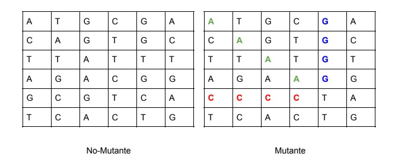

# Java-ADN-Mutante

<div style="text-align:center"></div>

- ### Examen:
Magneto quiere reclutar la mayor cantidad de mutantes para poder lucharcontra los X-Men.
Te ha contratado a ti para que desarrolles un proyecto que detecte si un humano es mutante basándose en su secuencia de ADN.
Para eso te ha pedido crear un programa con un método o función con la siguiente firma (En alguno de los siguiente lenguajes: Java / Golang / C-C++ / Javascript (node) / Python / Ruby):

#### boolean isMutant(String[] dna); // Ejemplo Java

En donde recibirás como parámetro un array de Strings que representan cada fila de una tabla de (NxN) con la secuencia del ADN. Las letras de los Strings solo pueden ser: (A,T,C,G), las cuales representa cada base nitrogenada del ADN.

<div style="text-align:center"></div>


Sabrás si un humano es mutante, si encuentras más de una secuencia de cuatro letras iguales​, de forma oblicua, horizontal o vertical.

Ejemplo (Caso mutante):

#### String[] dna = {"ATGCGA","CAGTGC","TTATGT","AGAAGG","CCCCTA","TCACTG"};

En este caso el llamado a la función isMutant(dna) devuelve “true”.
Desarrolla el algoritmo de la manera más eficiente posible.

## Desafíos:

#### Nivel 1:
Programa (en cualquier lenguaje de programación) que cumpla con el método pedido por Magneto.
#### Nivel 2:
Crear una API REST, hostear esa API en un cloud computing libre (Google App Engine, Amazon AWS, etc), crear el servicio “/mutant/” en donde se pueda detectar si un humano es mutante enviando la secuencia de ADN mediante un HTTP POST con un Json el cual tenga el siguiente formato:
```
POST → /mutant/
{
“dna”:["ATGCGA","CAGTGC","TTATGT","AGAAGG","CCCCTA","TCACTG"]
}
```


En caso de verificar un mutante, debería devolver un HTTP 200-OK, en caso contrario un 403-Forbidden
#### Nivel 3:
Anexar una base de datos, la cual guarde los ADN’s verificados con la API. Solo 1 registro por ADN. Exponer un servicio extra “/stats” que devuelva un Json con las estadísticas de las verificaciones de ADN: 
```
    {“count_mutant_dna”:40, “count_human_dna”:100: “ratio”:0.4} 
```    
Tener en cuenta que la API puede recibir fluctuaciones agresivas de tráfico (Entre 100 y 1 millón de peticiones por segundo).
Test-Automáticos, Code coverage > 80%.
Entregar:
*   Código Fuente (Para Nivel 2 y 3: En repositorio github).
*   Instrucciones de cómo ejecutar el programa o la API. (Para Nivel 2 y 3: En README de
github).
*   URL de la API (Nivel 2 y 3).

## Documentación y ejecución

La ejecución de busqueda se realizó a través de hilos los cuales permiten una ejecución concurrente lo cual permite un mejor aprovechamiento de procesador y una respuesta mas rápida para obtener el resultado en llamados concurrentes y pruebas de stress.

#### TEST


#### URLS

```
[POST] https://v8it0pdnv7.execute-api.us-east-1.amazonaws.com/dev/stats

[POST] https://v8it0pdnv7.execute-api.us-east-1.amazonaws.com/dev/mutans
```
[BODY] 

```
MUTANT ==>{"dna":["ATGCGA","CAGTGC","TTATGT","AGAAGG","CCCCTA","TCACTG"]}

HUMAN ==>{"dna":["ATGCAT","GCATGC","ATGCAT","GCATGC","ATGCAT","GCATGC"]}
```


#### HUMAN
petición post


#### MUTANT
petición post


#### STATS
petición post


#### CLOUD Y ARQUITECTURA

Se escogio aws lambda , ApiGateway y DynamoDB ya que son sistemas que tienen facturación mientras se esten ejecutando y ademas provee un sistema elastico que se encarga de crear instancias de las funciones lambda que se necesiten según el número de peticiones que ingresan, ademas se puede disminuir dinamicamente.
<br/>
 <div style="text-align:center"></div>
